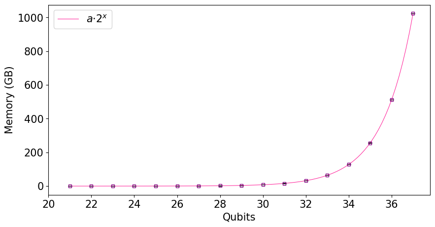
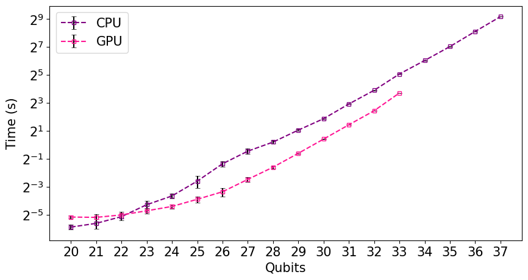
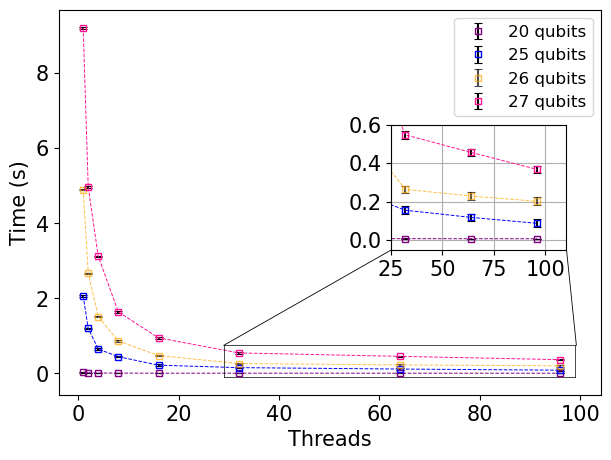
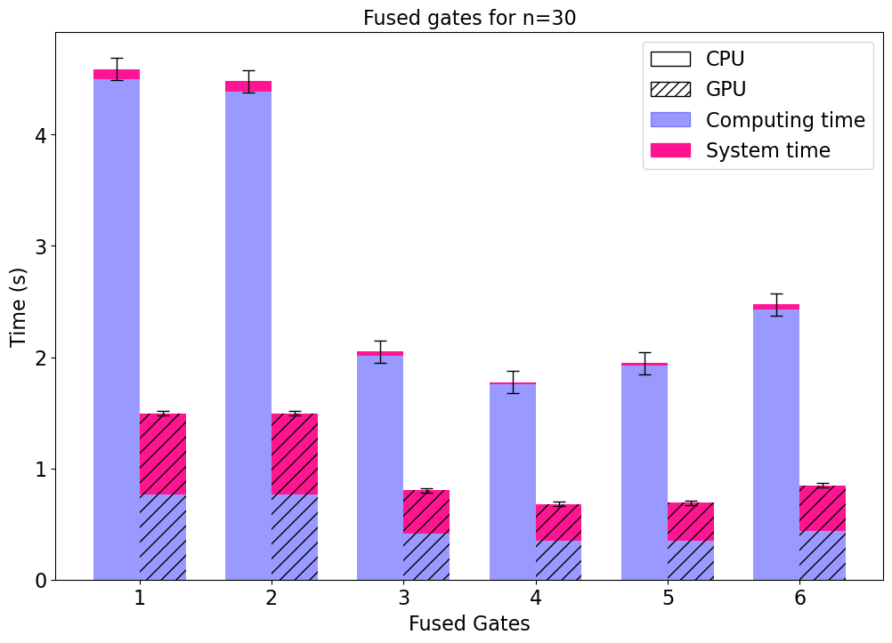

# HPC and optimization seminar

We explore how to use Scalene, a profiler that provides insights into the resource usage of our jobs. We explain how to use SLURM on the Proteus cluster to efficiently submit jobs to different nodes and GPUs. Finally, we explain how to use an optimized high-performance quantum circuit simulator, QSim, on a heterogenous cluster on multi-CPUs and GPUs.

## 1. Scalene

Repository: https://github.com/plasma-umass/scalene

Scalene is a high-performance CPU, GPU and memory profiler for Python. You can use Scalene at the command line of your terminal (recommended), or as a Visual Studio Code extension. See more info in [scalene_command_line](scalene_command_line.md).

### Memory profiling

With Scalene, you can determine how much memory your job requires, allowing you to reserve only the necessary amount. Here's an example of memory profiling for a quantum circuit of size *n*:



### Time profiling

You can also analyze when it is better to simulate your code on a CPU or a GPU.



## 2. Slurm

The scheduler decides where and when jobs are executed. Slurm is the scheduler used in PROTEUS. The job parameters are specified through a job description file or directly from the command line, such as the executable name and working directory, hardware requirements (number of processors, required memory (limited to 700MB per core) and disk space, etc.), and the maximum execution time.

PROTEUS user manual: https://proteus.ugr.es/docs/manual-uso/

You can find an exemple of job description file using Scalene in this [slurm script](scalene.slurmscript). Once you have the job description file created, you can send the job from the command line:

```
$ sbatch scalene.slurmscript
```

Alternatively to using `sbatch` and manually specifying the job, you can use the program `slanzarv`, a script that simplifies this process:

```
$ slanzarv -m 8500 --partition GPGPU -c 16 --gpu --gputype a100 scalene --outfile outfile.html  --reduced-profile --cpu-sampling-rate 0.01 qsim_seminar.py

```

Here, 16 cores and the A100 GPU have been reserved. Regarding the number of cores, using more cores is not always better, as performance can sometimes degrade. In the following graph, Scalene has been used to profile the execution time as a function of the number of cores:




## 3. Qsim

Qsim is a Schrödinger full state-vector simulator. It computes all the $2^n$ amplitudes of the state vector, where _n_ is the number of qubits. It's designed to run on multicore systems and GPUs. Check this [qsim exemple](Qsim_seminar.ipynb) to see how to optimice the simulation using the GPU and selecting the number of threads and fused gates.

Gate fusion allows us to work with matrices that fit into cache memory, the closest memory, thereby avoiding the time overhead of moving information over long distances. Let's look at an example: with 30 qubits, it is 4 on both the CPU and GPU:



More about qsim: https://quantumai.google/qsim
